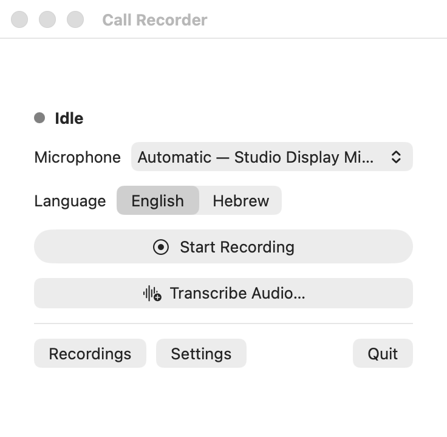

# Call Recorder

Call Recorder is a native macOS menu-bar app that records system audio and your
microphone locally, then transcribes the recording after you stop. It does not
change the audio devices used by Zoom, Meet, Teams, FaceTime, Slack, or other
call apps.



## Download

Download the latest Apple silicon DMG from
[GitHub Releases](https://github.com/bornio/call-recorder/releases/latest), open
it, and drag Call Recorder to Applications. The release supports M1 and newer
Macs running macOS 14.2 or later.

The free release is ad-hoc signed rather than Apple-notarized. The first time
you open it, macOS may require **System Settings → Privacy & Security → Open
Anyway**. No Terminal commands are required.

## Requirements

- An Apple silicon Mac (M1 or newer)
- macOS 14.2 or later
- Swift 6 with a matching macOS SDK, from Xcode or Command Line Tools
- A [Deepgram](https://deepgram.com/) API key for transcription

The project has no third-party code dependencies. Full Xcode is not required
when compatible Command Line Tools are installed.

## Build and install

From the repository root:

```sh
./scripts/test.sh
./scripts/build-app.sh release
mkdir -p "$HOME/Applications"
ditto ".build/Call Recorder.app" "$HOME/Applications/Call Recorder.app"
open "$HOME/Applications/Call Recorder.app"
```

This installs the app for the current user without `sudo`. To install it for
all users, copy the built app to `/Applications` instead if your account has
permission.

The build script creates an ad-hoc signed local bundle at
`.build/Call Recorder.app` and verifies its signature. Rebuilding the
executable may cause macOS to request privacy access again.

For development, build and open the app in place:

```sh
./scripts/build-app.sh debug
./scripts/launch-app.sh
```

## First use

1. Click the waveform icon in the menu bar and open **Settings**.
2. Save your Deepgram API key. It is stored in macOS Keychain and is never
   displayed again or written to a recording.
3. Choose your transcript name, microphone, and output folder. **Automatic**
   prefers a microphone already active in another app, then the macOS default
   input. Optionally enable paid keyterm prompting for names and jargon.
4. Choose **Start Recording** and grant Microphone and System Audio Recording
   access when macOS asks.
5. Choose **Stop Recording**. The app finalizes the local audio before starting
   the Deepgram request.

If access was previously denied, use the permission buttons in Settings, grant
access in System Settings, then quit and reopen Call Recorder.

The output folder must be local. Network volumes and iCloud-synced folders are
rejected so capture data does not leave the Mac during a call.

## Output and recovery

Each completed call creates one folder:

```text
2026-07-10 14-30 — Call/
├── Audio.m4a
└── Transcript.md
```

`Audio.m4a` is stereo AAC: channel 0 is system audio and channel 1 is the
selected microphone, labeled with the name configured in Settings. The
Markdown frontmatter includes capture times, timezone, duration, recording ID,
language, and origin.

Passages with low transcription or speaker confidence are marked _[review]_
without adding confidence scores to every line.

Recoverable chunks and structured transcription data remain private under
`~/Library/Application Support/Call Recorder/Recordings`. Temporary audio is
removed only after the published M4A has been reopened and validated.

If finalization or transcription fails, the retained recording appears in
**Recordings** with a recovery or retry action. A failed upload never deletes
the local audio. Quitting or sleeping during capture preserves completed chunks
without starting a network request.

You can also choose **Transcribe Audio…** or drop an existing audio file into
the Recordings window. The app writes Markdown beside the source without
overwriting an existing file and never takes ownership of imported audio.

## Privacy and capture behavior

- Recording starts and stops only through explicit user actions and remains
  visibly indicated.
- No transcription or network activity occurs while recording.
- Deepgram requests use Nova-3 and opt the submitted audio out of model
  improvement.
- Custom key terms are sent only when the separately billed option is enabled.
- System audio and microphone audio remain separate and time-aligned.
- The app excludes itself from system capture, never mutes captured processes,
  and never changes the default input or output device.
- Capture failures and dropped samples are surfaced instead of hidden.

For local development only, `DEEPGRAM_API_KEY` can override the Keychain value
in the app environment. Do not store it in the repository or pass it as a
command-line argument.

## Hardware verification

Automated tests do not request privacy permissions or activate audio hardware.
Before relying on the app, make one short test recording:

1. Note the current default input and output devices.
2. Play speech through the output while speaking into the selected microphone.
3. Confirm the timer, recording indicator, and both level meters move.
4. Stop and confirm the default devices are unchanged.
5. Confirm `Audio.m4a` plays both sides and `afinfo Audio.m4a` reports two
   channels.
6. Confirm `Transcript.md` appears with a valid Deepgram key.
7. Repeat once with networking unavailable after recording, then reconnect and
   verify **Retry Transcription** succeeds.

When available, repeat the audio check with internal speakers, wired
headphones, and Bluetooth headphones. Changing the output or microphone during
recording must stop visibly and preserve completed chunks.

For a 20-second runtime profile during an explicitly started benign recording:

```sh
./scripts/profile-recording.sh 20
```

## Publishing a release

Maintainers with write access can run the **Release** workflow from the GitHub
Actions tab using a version such as `0.1.0`. After the protected `release`
environment is approved, GitHub tests and builds the ARM64 app, creates a DMG
and checksum, and publishes them as a GitHub Release.

## Design and API references

See [ARCHITECTURE.md](docs/ARCHITECTURE.md) for capture and failure boundaries
and [IMPLEMENTATION_BRIEF.md](docs/IMPLEMENTATION_BRIEF.md) for the product
contract.

- [Apple: Capturing system audio with Core Audio taps](https://developer.apple.com/documentation/coreaudio/capturing-system-audio-with-core-audio-taps)
- [Apple: AudioHardwareCreateProcessTap](https://developer.apple.com/documentation/coreaudio/audiohardwarecreateprocesstap(_:_:))
- [Deepgram: Pre-recorded audio API](https://developers.deepgram.com/reference/speech-to-text/listen-pre-recorded)
- [Deepgram: Supported audio formats](https://developers.deepgram.com/docs/supported-audio-formats)
- [Deepgram: Models and languages](https://developers.deepgram.com/docs/models-languages-overview)

## License

[MIT](LICENSE)
